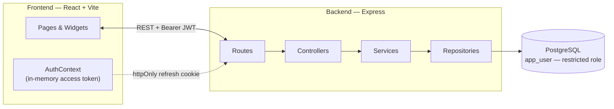
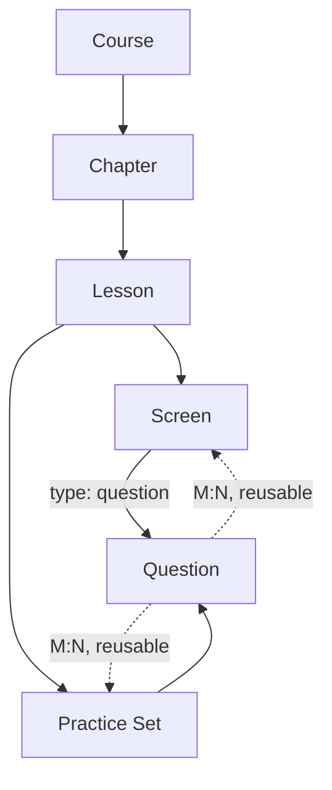

<div align="center">
  

  # Qubit — NUST

  ### See the qubit before you compute with it.

  An interactive quantum computing platform that teaches through real, manipulable simulations —
  a draggable Bloch sphere, live gate circuits, quantum-state readouts — not static diagrams.
  Built for the NUST Quantum Computing Lab.

  [](code/backend)
  [](code/frontend)
  [](code/backend)
  [](code/docker-compose.yml)
  [](code/frontend)
  [](code/backend/tests)
  [](code/frontend/src)
  [](#project-status)

</div>

---

## What this is

A STEM learner with basic programming and math but no prior linear algebra or quantum mechanics
should be able to walk away from a lesson able to *explain* a concept, not just recite that they
cleared a screen. Qubit teaches three full courses — **Quantum Computing Hardware**, **Quantum
Algorithms**, and **Quantum Machine Learning** — through a sequential lesson player (the same
explanation → simulation → question rhythm popularized by Brilliant.org), eight shared
interactive widgets, practice sets, and a light XP/streak layer that never competes with the
physics for attention.

**Correctness before charm.** Every simulation — the Bloch sphere most of all — is built to read
as a precision instrument being manipulated, not a decorative toy.

## Highlights

- 🎯 **8 interactive widgets**, not 8 static illustrations — MCQ, numeric input, drag-to-order,
  amplitude bar chart, topology diagram, a 2×2 quadrant selector, a basis-encoding number input,
  and a fully draggable 3D **Bloch sphere** with six distinct physical modes (free placement,
  gate application, a rotation slider, a measurement-collapse demo, T1 relaxation, and T2
  dephasing).
- 💡 **Hints before, explanations after.** Every question offers an optional pre-attempt hint and
  a real explanation once it's graded — server-enforced so the explanation can never leak before
  the attempt is submitted.
- 🔐 **Defense-in-depth auth.** In-memory access tokens, httpOnly rotating refresh cookies with
  reuse-detection (a stolen, already-used token revokes every session), and a two-role Postgres
  setup where the audit log's `UPDATE`/`DELETE` grants are revoked from the app's own database
  role — so tampering is blocked even if the application itself is fully compromised.
- 🌐 **Public course previews.** Anyone can browse the syllabus and narrative for all three
  courses without an account; the actual teaching content stays behind a free signup.
- ♿ **Built to WCAG AA**, with a real keyboard-operable alternative for the drag-to-order widget
  and full `prefers-reduced-motion` support throughout — not retrofitted, checked at every step.

## Architecture



The backend enforces one layering rule mechanically, not just by convention: a controller or
middleware file that imports a repository directly fails `npm run lint` (`eslint-plugin-import`'s
`no-restricted-paths`, configured in `code/backend/eslint.config.js`). Full rationale in
[`docs/04-application-architecture.md`](docs/04-application-architecture.md).

## Content model



`Question` has no direct foreign key to `Screen` or `PracticeSet` — the same question bank is
shared across both via junction tables, so a question authored once can appear inside a lesson
*and* in a later review practice set.

## The three courses

| Course | Chapters | Lessons | Screens | Questions |
|---|---|---|---|---|
| **Quantum Computing Hardware** | 6 | 22 | 92 | 72 |
| **Quantum Algorithms** | 6 | 24 | 110 | 81 |
| **Quantum Machine Learning** | 6 | 25 | 120 | 65 |

Every question in every course has a real, physics-accurate hint and a post-attempt explanation —
not filler text. Full lesson-by-lesson breakdowns: [`docs/08`](docs/08-quantum-machine-learning-course.md) ·
[`docs/09`](docs/09-quantum-algorithms-course.md) · [`docs/10`](docs/10-quantum-computing-hardware-course.md).

## Tech stack

| Layer | Choice | Why |
|---|---|---|
| Frontend | React 18 + Vite | Fast dev loop, no framework tax for a mostly-client-rendered app |
| 3D rendering | three.js + `@react-three/fiber` | Real, continuously-rotating 3D Bloch sphere, not a flat SVG approximation |
| Backend | Node.js + Express | Small REST surface, no need for a heavier framework |
| Database | PostgreSQL 16 | Relational integrity for a genuinely relational content hierarchy |
| Auth | `argon2` + `jsonwebtoken` | Argon2id hashing, short-lived JWT access tokens, rotating refresh cookies |
| Validation | `zod` | Type-branching schema validation for polymorphic `Screen`/`Question` content |
| Testing | `node:test` + `supertest` (backend), Vitest + Testing Library (frontend) | Native to each runtime, no extra tooling tax |
| Error tracking | Sentry (both ends) | Genuine no-op until a real project DSN is configured |

## Getting started

### Prerequisites
Node.js 20+, Docker (for local Postgres).

### 1. Database
```bash
cd code
docker compose up -d
```

### 2. Backend
```bash
cd code/backend
cp .env.example .env        # fill in DATABASE_URL, JWT_ACCESS_SECRET, etc.
npm install
npm run migrate             # applies migrations 000-018 in order
npm run create-admin -- you@example.com "Your Name" admin
npm run seed -- seeds/seed_course_hardware.json you@example.com
npm run seed -- seeds/seed_course_algorithms.json you@example.com
npm run seed -- seeds/seed_course_qml.json you@example.com
npm run dev                 # http://localhost:4000
```

### 3. Frontend
```bash
cd code/frontend
cp .env.example .env        # VITE_API_URL=http://localhost:4000
npm install
npm run dev                 # http://localhost:5173
```

## Testing

```bash
cd code/backend && npm test    # 135 tests — node:test + supertest against a real test database
cd code/frontend && npm test   # 390+ tests — Vitest + Testing Library
```

Dedicated risk-area coverage lives in `code/backend/tests/integration/ownership.*.test.js` —
cross-instructor access, question edit-access via both attachment paths independently, and the
audit log's grant enforcement verified against a real Postgres connection, not mocked.

## Repository layout

```
.
├── docs/                          Design & content specs, written before any code
│   ├── 01-data-model.md           Schema, ER diagram, rationale
│   ├── 02-api-contract.md         Every endpoint, request/response shape, role rules
│   ├── 03-security-architecture.md  Auth flow, RBAC, rate limiting
│   ├── 04-application-architecture.md  Layering rules, folder structure
│   ├── 06-threat-model.md         STRIDE model per actor, accepted risks
│   └── 07-10                      Full course content specs
├── code/
│   ├── backend/                   Express API — routes → controllers → services → repositories
│   ├── frontend/                  React + Vite app
│   └── docker-compose.yml         Local Postgres
├── render.yaml                    Render Blueprint (backend + database)
├── PRODUCT.md                     Brand personality, target users, anti-references
└── DESIGN.md                      Full design-token system (Pumpkin/Charcoal palette)
```

## Project status

Backend, frontend, all eight widgets, integration/QA, accessibility polish, and content for all
three courses are complete and tested. Deployment prep (Render + Vercel configs, cross-origin
cookie handling, Postgres TLS) is done and committed.

## Author

**Taha Mehdi** — Backend Engineer
Internship, Quantum Computing Lab, NUST
