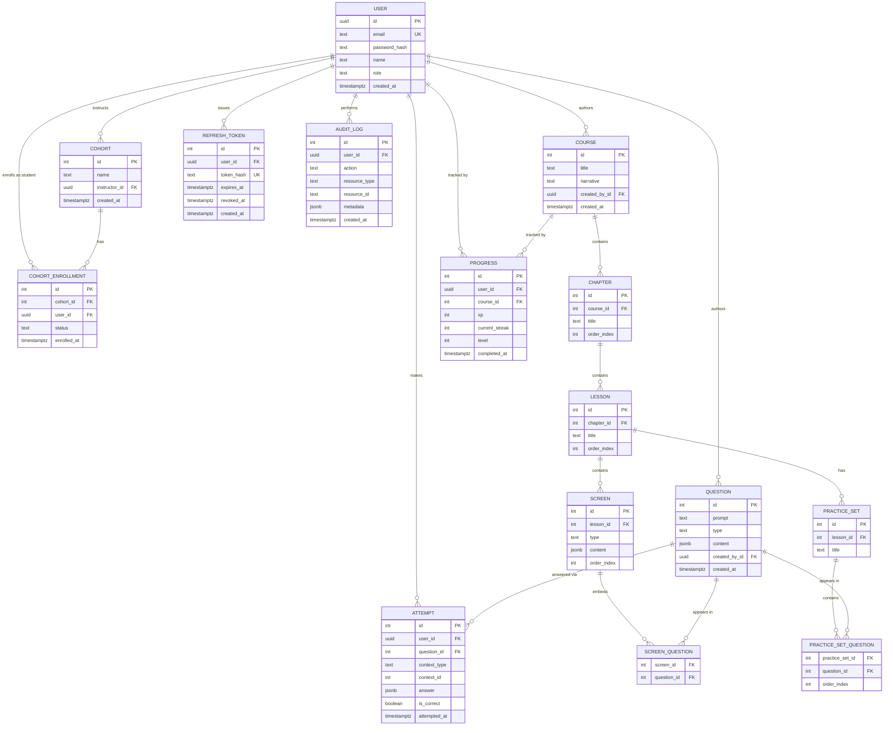

# EduTech Quantum Platform — Data Model

**Status:** Finalized
**Phase:** Data Architecture (Step 1 of pre-implementation design)
**Last updated:** June 2026

This document is the single source of truth for the database schema. It should be treated as a contract: the migration files in code must match this document, and any schema change should be made here first, then reflected in code — not the other way around.

---

## 1. Entity-Relationship Diagram



---

## 2. Design Decisions & Rationale

These are documented so the *reasoning* survives, not just the result — important for a solo build, since there's no co-author to remember "why" later.

| Decision | Rationale |
|---|---|
| `User.id` is `UUID`, all other PKs are `INTEGER` | User IDs are the most likely to leak into URLs/client state; UUIDs prevent enumeration of accounts by guessing sequential IDs. Other tables are internal-only, so simple integers are fine. |
| Three roles: `learner`, `instructor`, `admin` | Instructors need scoped access to only their own cohort's data; collapsing into `admin` would either over-grant access or require workaround checks in code. |
| `Question` has no direct FK to `Screen` or `PracticeSet` | Questions are reusable across multiple screens and practice sets — a many-to-many relationship, resolved via junction tables (`ScreenQuestion`, `PracticeSetQuestion`) rather than a single FK. |
| `Cohort` has no `course_id` | One cohort can work through multiple courses over time; cohort membership and course progress are tracked independently. |
| `CohortEnrollment.status` instead of deleting rows | Preserves enrollment history (a student removed from a cohort isn't erased from history) — supports a future "cohort history" view on the instructor dashboard. |
| Partial unique index on `CohortEnrollment (cohort_id, user_id) WHERE status = 'active'` | A student can only have one *active* enrollment per cohort at a time, but can have multiple historical (`removed`) rows. A flat `UNIQUE` constraint can't express this conditional rule. |
| `Progress` doubles as the User↔Course junction table | Enrollment-with-data is a common pattern: rather than a separate plain junction table plus a separate stats table, `Progress` carries both the relationship and the XP/streak/level payload. Unique on `(user_id, course_id)`. |
| `Attempt.context_type` / `context_id` (polymorphic, no FK) | An attempt can happen on a `Screen` or in a `PracticeSet`. Since a FK can only reference one table, this pairing is validated in application code, not the database. **Action item:** write a unit test asserting invalid context references are rejected at the API layer. |
| `Attempt.is_correct` is stored, not derived live | Deliberate denormalization for fast dashboard queries (e.g. "common wrong answers per question") without re-grading every attempt on read. **Tradeoff:** if a question's correct answer is edited later, historical `is_correct` values won't retroactively update. |
| `Screen.content` and `Question.content` are `JSONB` | Screen/question types vary significantly (plain text, Bloch sphere widget config, circuit builder state). `JSONB` avoids a schema migration every time a new interactive type is added. **Tradeoff:** the database cannot validate the internal shape of this JSON — this must be enforced in application code via a schema validator (e.g. Zod) before writes, especially from the admin content tool. |
| `order_index` on `Chapter`, `Lesson`, `Screen`, `PracticeSetQuestion` | Row insertion order is never guaranteed by SQL — explicit ordering columns are required wherever sequence matters. |
| `RefreshToken` as its own table (not a single column on `User`) | JWTs are stateless by default, so the server has no way to revoke one before its natural expiry unless it tracks issued tokens itself. A separate table (rather than one `current_refresh_token_hash` column on `User`) supports multiple simultaneous sessions — a student logged in on a lab desktop and their own laptop at once — without one login silently logging out the other. `revoked_at` is nullable and follows the same "mark, don't delete" pattern as `CohortEnrollment.status`, preserving session history instead of erasing it on logout. |
| `RefreshToken.user_id` uses `ON DELETE CASCADE` | Unlike `CohortEnrollment`, a session row has no historical value once its owning user is gone — there's nothing worth preserving, so cascading delete (rather than restrict or mark-and-keep) is the right behavior here. |
| `RefreshToken.id` reused as the access token's `jti` claim | An access token needs to be revocable before its natural 15-minute expiry (e.g. on logout), but JWTs are otherwise stateless. Rather than introduce a separate blocklist table, the access token's `jti` is set to its paired `RefreshToken` row's id at login — checking "is this access token still valid" becomes "is the `RefreshToken` row it's paired with still un-revoked," reusing existing infrastructure instead of duplicating it. See `03-security-architecture.md`. |
| `Course.created_by_id` | Surfaced during security architecture design: content edit permissions needed to be scoped per-instructor ("an instructor can only edit courses they created"), which required an owner field that didn't exist anywhere in the original content hierarchy. Added at the `Course` level only — ownership cascades down to Chapter/Lesson/Screen by walking up the hierarchy at check time, rather than duplicating an owner field on every level. |
| `Question.created_by_id` | Surfaced during threat modeling (Instructor actor, Tampering): `Question` had no owner at all, meaning any instructor/admin could edit any question regardless of which courses it was attached to. Unlike `Course`, ownership here can't simply cascade from a single parent — a `Question` can be attached to multiple courses owned by different instructors (the entire point of its M:N reusability, per Step 1). Edit access is therefore defined as creator-OR-attached-to-an-owned-course, a deliberately broader rule than simple ownership — see `06-threat-model.md` for the accepted shared-mutable-resource tradeoff this creates. |
| `AuditLog` as a new, append-only table | Added during threat modeling once it became clear that ownership/role checks cannot defend against a compromised admin account by definition — the attacker already holds the role those checks are built to verify. The audit log is a detection-and-recovery control, not a prevention control: it does not stop a compromised admin from acting, but makes those actions traceable afterward. `resource_id` is stored as `TEXT` rather than a typed FK, since a single table covering every resource type can't have one strongly-typed reference column, and because a `FOREIGN KEY` would actively break logging of a resource's own deletion. See `06-threat-model.md`. |

---

## 3. Full Column Specification

### `User`
| Column | Type | Constraints |
|---|---|---|
| id | UUID | PRIMARY KEY, DEFAULT gen_random_uuid() |
| email | TEXT | NOT NULL, UNIQUE |
| password_hash | TEXT | NOT NULL |
| name | TEXT | NOT NULL |
| role | TEXT | NOT NULL, CHECK (role IN ('learner','instructor','admin')) |
| created_at | TIMESTAMPTZ | NOT NULL, DEFAULT now() |

### `Cohort`
| Column | Type | Constraints |
|---|---|---|
| id | INTEGER | PRIMARY KEY |
| name | TEXT | NOT NULL |
| instructor_id | UUID | NOT NULL, FK → User.id |
| created_at | TIMESTAMPTZ | NOT NULL, DEFAULT now() |

> Note: the database cannot enforce that `instructor_id` references a User with `role = 'instructor'` — a plain FK only checks existence, not role. Enforce this in application code (e.g. at the route that creates a Cohort).

### `CohortEnrollment`
| Column | Type | Constraints |
|---|---|---|
| id | INTEGER | PRIMARY KEY |
| cohort_id | INTEGER | NOT NULL, FK → Cohort.id |
| user_id | UUID | NOT NULL, FK → User.id |
| status | TEXT | NOT NULL, DEFAULT 'active', CHECK (status IN ('active','removed')) |
| enrolled_at | TIMESTAMPTZ | NOT NULL, DEFAULT now() |

```sql
CREATE UNIQUE INDEX one_active_enrollment_per_cohort
ON cohort_enrollment (cohort_id, user_id)
WHERE status = 'active';
```

### `Course`
| Column | Type | Constraints |
|---|---|---|
| id | INTEGER | PRIMARY KEY |
| title | TEXT | NOT NULL |
| narrative | TEXT | nullable |
| created_by_id | UUID | NOT NULL, FK → User.id |
| created_at | TIMESTAMPTZ | NOT NULL, DEFAULT now() |

> Note: same limitation as `Cohort.instructor_id` — the database cannot enforce that `created_by_id` references a User with `role IN ('instructor','admin')`. Enforced in application code at course-creation time.
>
> **Cascade rule:** `Course → Chapter → Lesson → Screen` all use `ON DELETE CASCADE`. Because this can delete a large amount of content in one action, `DELETE /courses/:id` requires an explicit `?confirm=true` query parameter at the API layer — see `03-security-architecture.md`. The same requirement applies to `DELETE /chapters/:id` and `DELETE /lessons/:id`, since both still cascade to children; `DELETE /screens/:id` does not, since screens are leaf nodes.

### `Chapter`
| Column | Type | Constraints |
|---|---|---|
| id | INTEGER | PRIMARY KEY |
| course_id | INTEGER | NOT NULL, FK → Course.id |
| title | TEXT | NOT NULL |
| order_index | INTEGER | NOT NULL |

### `Lesson`
| Column | Type | Constraints |
|---|---|---|
| id | INTEGER | PRIMARY KEY |
| chapter_id | INTEGER | NOT NULL, FK → Chapter.id |
| title | TEXT | NOT NULL |
| order_index | INTEGER | NOT NULL |

### `Screen`
| Column | Type | Constraints |
|---|---|---|
| id | INTEGER | PRIMARY KEY |
| lesson_id | INTEGER | NOT NULL, FK → Lesson.id |
| type | TEXT | NOT NULL, CHECK (type IN ('explanation','question','simulation')) |
| content | JSONB | nullable — validate shape in application code |
| order_index | INTEGER | NOT NULL |

### `Question`
| Column | Type | Constraints |
|---|---|---|
| id | INTEGER | PRIMARY KEY |
| prompt | TEXT | NOT NULL |
| type | TEXT | NOT NULL, CHECK (type IN ('mcq','drag_drop','numeric')) |
| content | JSONB | nullable — validate shape in application code |
| created_by_id | UUID | NOT NULL, FK → User.id |
| created_at | TIMESTAMPTZ | NOT NULL, DEFAULT now() |

> Note: same limitation as `Cohort.instructor_id`/`Course.created_by_id` — the database cannot enforce that `created_by_id` references a User with `role IN ('instructor','admin')`. Enforced in application code at question-creation time.
>
> **Edit access** is broader than ownership: any instructor who has attached this question to one of their own courses can edit it, not just the creator. See `06-threat-model.md` for the reasoning and the accepted shared-mutable-resource tradeoff. `DELETE` cascades to `ScreenQuestion`/`PracticeSetQuestion` rows with no pre-check for existing attachments — also a deliberately accepted risk, documented in the same section.

### `ScreenQuestion` (junction)
| Column | Type | Constraints |
|---|---|---|
| screen_id | INTEGER | NOT NULL, FK → Screen.id |
| question_id | INTEGER | NOT NULL, FK → Question.id |

Composite PRIMARY KEY: `(screen_id, question_id)`

### `PracticeSet`
| Column | Type | Constraints |
|---|---|---|
| id | INTEGER | PRIMARY KEY |
| lesson_id | INTEGER | NOT NULL, FK → Lesson.id |
| title | TEXT | NOT NULL |

### `PracticeSetQuestion` (junction)
| Column | Type | Constraints |
|---|---|---|
| practice_set_id | INTEGER | NOT NULL, FK → PracticeSet.id |
| question_id | INTEGER | NOT NULL, FK → Question.id |
| order_index | INTEGER | NOT NULL |

Composite PRIMARY KEY: `(practice_set_id, question_id)`

### `Attempt`
| Column | Type | Constraints |
|---|---|---|
| id | INTEGER | PRIMARY KEY |
| user_id | UUID | NOT NULL, FK → User.id |
| question_id | INTEGER | NOT NULL, FK → Question.id |
| context_type | TEXT | NOT NULL, CHECK (context_type IN ('screen','practice_set')) |
| context_id | INTEGER | NOT NULL — no FK (polymorphic); validate existence in application code |
| answer | JSONB | NOT NULL |
| is_correct | BOOLEAN | NOT NULL |
| attempted_at | TIMESTAMPTZ | NOT NULL, DEFAULT now() |

### `Progress`
| Column | Type | Constraints |
|---|---|---|
| id | INTEGER | PRIMARY KEY |
| user_id | UUID | NOT NULL, FK → User.id |
| course_id | INTEGER | NOT NULL, FK → Course.id |
| xp | INTEGER | NOT NULL, DEFAULT 0, CHECK (xp >= 0) |
| current_streak | INTEGER | NOT NULL, DEFAULT 0, CHECK (current_streak >= 0) |
| level | INTEGER | NOT NULL, DEFAULT 1 |
| completed_at | TIMESTAMPTZ | nullable |

```sql
UNIQUE (user_id, course_id)
```

### `RefreshToken`
| Column | Type | Constraints |
|---|---|---|
| id | INTEGER | PRIMARY KEY |
| user_id | UUID | NOT NULL, FK → User.id, **ON DELETE CASCADE** |
| token_hash | TEXT | NOT NULL, UNIQUE |
| expires_at | TIMESTAMPTZ | NOT NULL |
| revoked_at | TIMESTAMPTZ | nullable — NULL means still valid |
| created_at | TIMESTAMPTZ | NOT NULL, DEFAULT now() |

> Store only a hash of the token (e.g. SHA-256), never the raw value — same principle as `User.password_hash`. If the database were ever read by an attacker, hashes alone can't be used to log in as anyone.
>
> `id` is reused as the access token's `jti` claim — see `03-security-architecture.md` for how this lets logout invalidate an access token early without a separate blocklist table.
>
> Refresh tokens are single-use: `POST /auth/refresh` revokes the row being used and issues a new one in the same request, via an atomic `UPDATE ... WHERE revoked_at IS NULL RETURNING *` (not a separate check-then-update) to avoid a race condition if the same token is submitted twice simultaneously. Reuse of an already-revoked token is treated as a signal of compromise and revokes every session for that user — see `03-security-architecture.md`.

### `AuditLog`
| Column | Type | Constraints |
|---|---|---|
| id | INTEGER | PRIMARY KEY |
| user_id | UUID | NOT NULL, FK → User.id |
| action | TEXT | NOT NULL — e.g. `'course.deleted'`, `'cohort.instructor_reassigned'` |
| resource_type | TEXT | NOT NULL — e.g. `'Course'`, `'Cohort'` |
| resource_id | TEXT | NOT NULL — stored as TEXT, not a typed FK; see note below |
| metadata | JSONB | nullable — e.g. `{ "cascadedChapters": 4 }` |
| created_at | TIMESTAMPTZ | NOT NULL, DEFAULT now() |

> **Append-only, enforced at the database level, not by application convention:**
> ```sql
> REVOKE UPDATE, DELETE ON audit_log FROM app_user;
> GRANT INSERT, SELECT ON audit_log TO app_user;
> ```
> This is deliberate: a convention of "the codebase never writes UPDATE/DELETE for this table" defends against bugs, but not against the actor this table exists for — a compromised admin (or anyone with the application's own database credentials) isn't bound by what the existing code happens to contain, and could otherwise run `DELETE FROM audit_log` directly. Revoking the privilege at the database level means the protection holds even if the application itself is fully compromised.
>
> **Why `resource_id` is TEXT, not a typed foreign key:** a single table logging actions across every resource type (`User`, `Course`, `Cohort`, etc.) can't have one strongly-typed reference column, since those resources use different ID types (UUID vs. integer). A `FOREIGN KEY` would also actively break the log's purpose in the most important case: logging that a resource was *deleted* — a FK would refuse to let that row exist once the referenced resource no longer does.
>
> **Logged actions are deliberately scoped, not exhaustive.** Covers actions where the admin ownership-bypass actually matters (course/chapter/lesson deletion, cohort-instructor reassignment, cohort deletion, role assignment via the seed script) — not every request. Read operations are not logged; mass data exfiltration via `GET` requests is a documented, accepted gap for this deployment's scale. See `06-threat-model.md` for the full reasoning.
>
> **The seed script (`scripts/create-admin.js`) writes its own entry directly**, since it runs outside the HTTP application entirely and has no controller to log through — see `03-security-architecture.md` Section 0.1 and `06-threat-model.md`.

---

## 4. Known Tradeoffs & Follow-up Action Items

These are intentional, documented gaps — not oversights. Tracked here so they aren't forgotten once implementation starts.

- [x] **`JSONB` content columns** (`Screen.content`, `Question.content`) — resolved in Step 3 (`03-security-architecture.md`): validated via Zod schemas branching on each row's sibling `type` field, enforced in the controller layer before any write.
- [x] **`Cohort.instructor_id` role check** — resolved in Step 3: enforced in application code at cohort-creation time, with an explicit admin-only carve-out to assign a cohort to a different instructor.
- [ ] **Polymorphic `Attempt.context_id`** has no database-level FK. Write an application-layer check (and a unit test) that rejects an `Attempt` if `context_id` doesn't actually exist in the table named by `context_type`. *(Validation order specified in `02-api-contract.md` Section 5.3; implementation still pending.)*
- [ ] **`Attempt.is_correct` is denormalized.** If a question's correct answer is ever edited, historical attempts will not retroactively reflect the change. Acceptable for now; document this if a "re-grade" feature is ever requested.
- [ ] **`Course.created_by_id` role check** is not DB-enforced, same limitation as `Cohort.instructor_id` originally had — enforce in application code at course-creation time.
- [ ] **`Question.created_by_id` role check** is not DB-enforced, same limitation as above — enforce in application code at question-creation time.
- [ ] **No endpoint or schema support for promoting a user to `instructor`/`admin`.** Deliberate — see `03-security-architecture.md` Section 0.1 for the seed-script mechanism used instead.
- [ ] **`Question` deletion cascade-detaches with no warning.** Deleting a shared `Question` silently removes it from every other instructor's course that referenced it, with no pre-check or notification. Deliberately accepted during threat modeling — see `06-threat-model.md`, Instructor actor, Tampering.
- [ ] **`AuditLog` covers writes only, not reads.** Mass data exfiltration via legitimate `GET` requests (e.g. by a compromised admin) leaves no trace. Accepted as disproportionate to this deployment's scale for now — see `06-threat-model.md`, Compromised Admin actor.

---

See `/docs` for subsequent design documents as they're produced.
